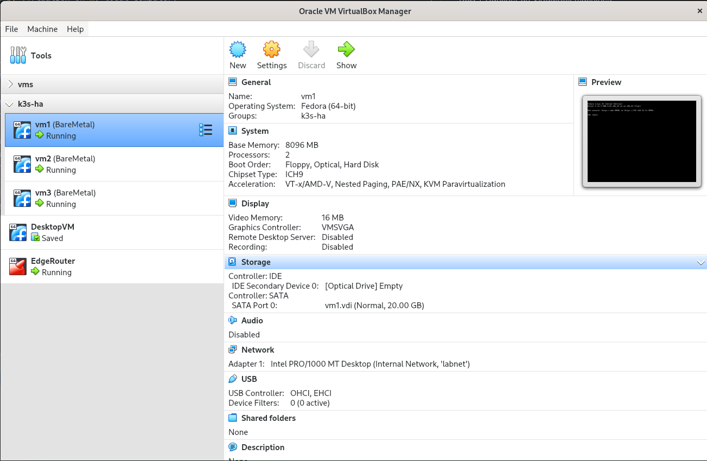
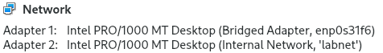
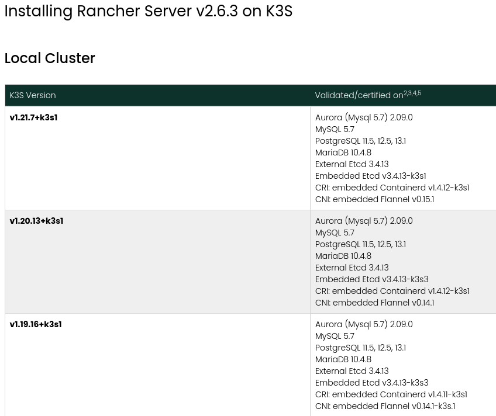
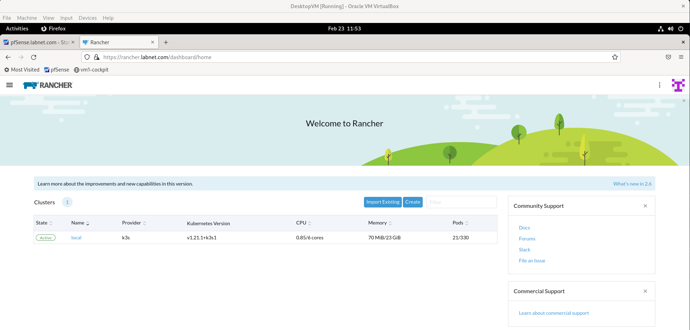
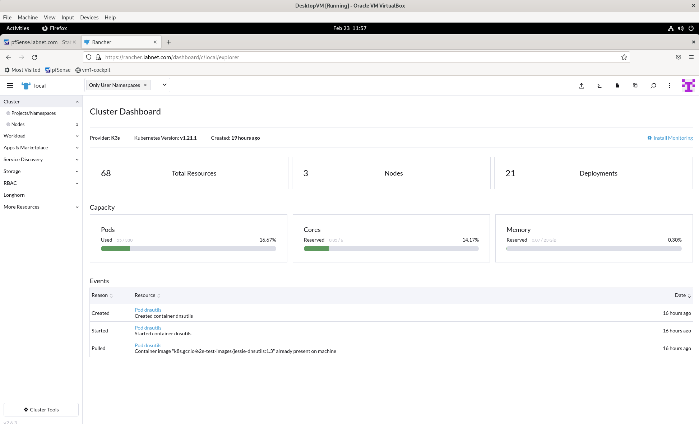

# k3s-rancher-poc guide
K3S + Rancher on VirtualBox machines

## Planning & Preface:
The goal of this README is to show how the K3S cluster can be bound together with Rancher 2.6.3
using virtual machines run by VirtualBox on my local computer.
In many tutorials found during my learning process I've found very irritating that someone paste a bunch
of shell commands and does not explain the decisions behind that, going to elaborate more on my decisions.

We will utilize k3s-version = v1.21.1+k3s1 for this purpose. I will later explain why (because there is always something newer).

## Physical infrastructure
Internet -> myISP router -> myComputer
my local network is somewhat ordinary like 192.168.1.0/24 and my computer has address like 192.168.1.15 .
Everything will be run on my single desktop computer which is a Dell with 64GB of RAM and 8cpu cores,
quite plenty of ram but this i7 is old, so not many threads.
Dell is running with Fedora 35 - normal workstation - nothing fancy.

## Virtual infrastructure and IP addressing and hints
VirtualBox is installed using this guide - https://computingforgeeks.com/how-to-install-virtualbox-on-fedora-linux/ 
if you run different distro follow the other guide

You need 3 strong virtual machines **vm1,vm2,vm3** with 2cpu each and at least 4GB memory assigned each.
First few tries I've failed with Rancher installation - it looked like 2GB was not enough there.
I'm also using another vm for Desktop access there and another as router (pfsense)
It looks like below: 


For VMs I've provisioned them with also Fedora 35 but a Server edition - which led to problems explained later in Ansible section;

### IP addressing inside Virtual Env
_192.168.33.1_        EdgeRoute (pfSense) <br> 
_192.168.33.10_       DesktopVM (Fedora Workstation) <br>
_192.168.33.11-18_    execution VMs (vm1-vm8) <br>
_192.168.33.20_       kube cluster virtual IP assigned later by kube-vip, used by kubectl <br>
_192.168.33.24-31_    Virtual IP assigned later using MetalLB load balancer <br>

EdgeRoute vm is having two network interfaces from VirtualBox perspective,
First is Bridged Adapter to DELL's phy network cart
Second is Internal Network called 'labnet'


### DNS inside Virtual Env
EdgeRouter _192.168.33.1_ serving local DNS resolver with such a static mapping and dns names: <br>
domain: labnet.com<br>
192.168.33.11 vm1.labnet.com<br>
192.168.33.12 vm2.labnet.com<br>
192.168.33.13 vm3.labnet.com<br>
192.168.33.22 rancher.labnet.com (Virtual IP later on) <br>
192.168.33.15 gitlab.labnet.com (Virtual IP later on) <br>

### Passwordless SSH 
I'm using the 192.168.33.10 (DesktopVM) as a jump host, there I'm going to run all scripts commands and Ansible playbooks.
For above and cluster to work you need to have a SSH paswordless login to root account (or not root but with sudo possible)
Set up SSH keys like that: https://www.ssh.com/academy/ssh/copy-id#copy-the-key-to-a-server <br>
From a jump host you should be able do like
`ssh vm1` and so on, please ensure it's working.

### Ensure FQDN hostnames on VM level
For each vm1,vm2,vm3
`sudo hostnamectl set-hostname vm1.labnet.com ` repeat in each. I'm not 100% convinced it's needed but I stepped on the problem
with CoreDNS (k3s dns) that it does not like the non-fqdn names. Aka dot:5 issue. <br>
Related reading: https://pracucci.com/kubernetes-dns-resolution-ndots-options-and-why-it-may-affect-application-performances.html

### Other hints for VirtualMachines
- set the ntp time synchronization and correct timezone
- use static dns
- watch out SELinux (Fedora/CentOS/Redhat)
- watch out the SecureBoot for VirtualBox modules (on host like Dell computer)

## Installation
SSH to the jump host (DesktopVM in my case 192.168.33.10) some preparation
- `mkdir ~/.kube`
- pull this repo in order to have the scrips ready `git pull ...`

### Ansible for VMs
Decided previously to use Fedora 35 Server to run on virtual machines, it was not a perfect decision
because it has some quirks. That is why I collected few commands to fire on vm1,vm2,vm3 using Ansible playbook. 
Generally for Fedora you have to turn off firewalld, systemd-resolved, instruct the NetworkManager to not manage Calico network interfaces,
Also upload some additional SSHd config, use static DNS config at resolv.conf . <br>
<br>
We will use Calico as network provided inside k3s (because the built-in traefik etc didnt work for CertManager later)
Calico needs special treat for Fedora like distros. Link: https://projectcalico.docs.tigera.io/maintenance/troubleshoot/troubleshooting#configure-networkmanager
<br>
Reconfigure the vm1,vm2,vm3 with ansible (inventory is a host list, playbook is a ansible script) :<br>
`cd reference` <br>
`ansible-playbook -i inventory playbook-01.yml` <br>
You should see success at the end, no errors. If ansible not there on the host, you have to install if of course first.
<br><br>
Virtual machines should be now ready for K3S installation

### K3S 
Why k3s-version = **v1.21.1+k3s1** ? Because by time of this exercise Rancher 2.6.3 would not start of newer k3s
like 1.22.x . Realized that painfully after full k3s installation and the Rachner said it wont start on incompatible cluster.<br>
Here is Rancher compatibility matrix: https://www.suse.com/suse-rancher/support-matrix/all-supported-versions/rancher-v2-6-3/


#### Install K3Sup
k3sup is a script which automate k3s installation:<br>
link: https://github.com/alexellis/k3sup#download-k3sup-tldr

#### Fire first node(vm1) k3s 
```
k3sup install \
  --ip=192.168.33.11 \
  --user=root \
  --ssh-key $HOME/.ssh/id_rsa \
  --cluster \
  --k3s-version=v1.21.1+k3s1 \
  --k3s-extra-args "--flannel-backend=none --cluster-cidr=10.10.0.0/16 --disable-network-policy --no-deploy=traefik --no-deploy=servicelb --node-ip=192.168.33.11" \
  --merge \
  --local-path $HOME/.kube/config \
  --context=k3s-ha
  ```
Explanation:
- ip and node-ip must be same, vm1 IP address
- user=root because we connect on ssh paswordless using root account
- cluster because it's gonna be cluster
- cluster-cidr remember this, all internal IP addressing will utilize that pool
- $HOME/.kube/config config will land there on DesktopVM (jump host)
- --disable things and --no-deploy : will install network powered by Calico.

It should now progress nice and clean. After installation please verify:
```
kubectl config set-context k3s-ha
kubectl get node -o wide
```
Should print like
```
[admin@desktopvm ~]$ kubectl get node -o wide
NAME   STATUS   ROLES                       AGE     VERSION        INTERNAL-IP     EXTERNAL-IP   OS-IMAGE                           KERNEL-VERSION           CONTAINER-RUNTIME
vm1    Ready    control-plane,etcd,master   3h39m   v1.21.1+k3s1   192.168.33.11   <none>        Fedora Linux 35 (Server Edition)   5.16.9-200.fc35.x86_64   containerd://1.4.4-k3s2
```
We good now, if you fire the `kubectl get pods -A` you will see they are not up, because network not there yet.

#### Give network using Calico

Info: https://projectcalico.docs.tigera.io/getting-started/kubernetes/k3s/multi-node-install

`wget https://projectcalico.docs.tigera.io/manifests/calico.yaml` <br>
Edit calico.yaml : `vi calico.yaml` look for **CALICO_IPV4POOL_CIDR** [link](reference/calico.yaml#L4222)<br>
make it same as `--cluster-cidr=10.10.0.0/16` otherwise network will be a crap. <br>
<br>
Apply calico.yaml `kubectl apply -f calico.yaml` allow few minutes. <br>
Check with: `kubectl get pods -A` , should see somewhat:
```
NAMESPACE                   NAME                                        READY   STATUS    RESTARTS   AGE
kube-system                 calico-kube-controllers-958545d87-z529h     1/1     Running   0          0h49m
kube-system                 calico-node-gldwc                           1/1     Running   0          0h49m
```
other pods should be also Running e.g. CoreDNS

#### Virtual IP by kube-vip
We need the cluster (though single node still for a while) to support various virtual IP address (192.168.33.20), e.g. for cluster itself
and for Load Balancer IPs too. For this purpose we need kube-vip <br>
<br>

Apply rules first: `kubectl apply -f https://kube-vip.io/manifests/rbac.yaml`

Now SSH to the vm1 node `ssh vm1` , now there execute commands (inside vm1 !!!):
- check what is internal network interface id with `ifconfig`, mine is **enp0s3**:
    ```
    enp0s3: flags=4163<UP,BROADCAST,RUNNING,MULTICAST>  mtu 1500
            inet 192.168.33.11  netmask 255.255.255.0  broadcast 192.168.33.255
    ```
- few commands, watch out IP and nic: **enp0s3**:
    ```
    ctr image pull docker.io/plndr/kube-vip:v0.4.2
    alias kube-vip="ctr run --rm --net-host docker.io/plndr/kube-vip:v0.4.2 vip /kube-vip"
    export VIP=192.168.33.20
    export INTERFACE=enp0s3
    kube-vip manifest daemonset --arp --interface $INTERFACE --address $VIP --controlplane --leaderElection --taint --inCluster | tee /var/lib/rancher/k3s/server/manifests/kube-vip.yaml
    ```
ctr is pulling image. VIP is the desired cluster virtual ip, INTERFACE is the interface from ifconfig.<br>
CTRL+D. Exit from vm1 to the jump host. <br>
Allow 2-3 mins, check with  `kubectl get pods -A` if kube-vip is UP, should see:
```
NAMESPACE                   NAME                                        READY   STATUS    RESTARTS   AGE
kube-system                 kube-vip-ds-l5smj                           1/1     Running   0          3h39m
```
Now the IP 192.168.33.20 should be pingable. Verify it by:
```
[admin@desktopvm ~]$ ping 192.168.33.20
PING 192.168.33.20 (192.168.33.20) 56(84) bytes of data.
64 bytes from 192.168.33.20: icmp_seq=1 ttl=64 time=0.487 ms
64 bytes from 192.168.33.20: icmp_seq=2 ttl=64 time=0.420 ms
64 bytes from 192.168.33.20: icmp_seq=3 ttl=64 time=0.432 ms
^C
--- 192.168.33.20 ping statistics ---
3 packets transmitted, 3 received, 0% packet loss, time 2051ms
rtt min/avg/max/mdev = 0.420/0.446/0.487/0.029 ms
```
You can change in `vi ~/.kube/config` the IP address from the first node to cluster IP.

Perfect then. Let's progress with some verification

#### DNS verification
It's been a sad time for me, because I recreated the cluster like maybe 15times. DNS is extremely important for kube system to work
internally and (which was not obvious) externally (for Rancher).
We have to verify whether all is good there in DNS.

Install DNS debugging pod `kubectl apply -f https://k8s.io/examples/admin/dns/dnsutils.yaml` <br>
when it's up fire those:
```
kubectl exec -i -t dnsutils -- nslookup kubernetes.default 
kubectl exec -i -t dnsutils -- nslookup git.rancher.io
```
**BOTH** needs to give correct answer like:
```
[admin@desktopvm ~]$ kubectl exec -i -t dnsutils -- nslookup kubernetes.default 
kubectl exec -i -t dnsutils -- nslookup git.rancher.io
Server:		10.43.0.10
Address:	10.43.0.10#53

Name:	kubernetes.default.svc.cluster.local
Address: 10.43.0.1

Server:		10.43.0.10
Address:	10.43.0.10#53

git.rancher.io	canonical name = ext-services-lb-2a685576fdf664e2.elb.us-west-2.amazonaws.com.
Name:	ext-services-lb-2a685576fdf664e2.elb.us-west-2.amazonaws.com
Address: 34.208.213.149
Name:	ext-services-lb-2a685576fdf664e2.elb.us-west-2.amazonaws.com
Address: 52.36.54.134

[admin@desktopvm ~]$
```
This will prove local and external DNS calls work.<br>
Debugging links:<br>
https://kubernetes.io/docs/tasks/administer-cluster/dns-debugging-resolution/ <br>
https://crt.the-mori.com/2020-03-18-coredns-connection-timeout-external-domain-name
<br><br>

#### 2nd and 3rd K3S nodes installation
We are now in good position to provision (join) the rest of k3s nodes (vm2,vm3). <br>
Apply commands:
```
k3sup join --ip 192.168.33.12 --server --server-ip 192.168.33.20 --k3s-version=v1.21.1+k3s1 --user root --ssh-key $HOME/.ssh/id_rsa  --k3s-extra-args "--flannel-backend=none --cluster-cidr=10.10.0.0/16 --disable-network-policy --no-deploy=traefik --no-deploy=servicelb --node-ip=192.168.33.12"
```

```
k3sup join --ip 192.168.33.13 --server --server-ip 192.168.33.20 --k3s-version=v1.21.1+k3s1 --user root --ssh-key $HOME/.ssh/id_rsa  --k3s-extra-args "--flannel-backend=none --cluster-cidr=10.10.0.0/16 --disable-network-policy --no-deploy=traefik --no-deploy=servicelb --node-ip=192.168.33.13"
```
Observe by `kubectl get pods -A` and `kubectl get node -o wide`, should end up with:<br>
```
[admin@desktopvm ~]$ kubectl get node -o wide
NAME   STATUS   ROLES                       AGE     VERSION        INTERNAL-IP     EXTERNAL-IP   OS-IMAGE                           KERNEL-VERSION           CONTAINER-RUNTIME
vm1    Ready    control-plane,etcd,master   4h25m   v1.21.1+k3s1   192.168.33.11   <none>        Fedora Linux 35 (Server Edition)   5.16.9-200.fc35.x86_64   containerd://1.4.4-k3s2
vm2    Ready    control-plane,etcd,master   4h16m   v1.21.1+k3s1   192.168.33.12   <none>        Fedora Linux 35 (Server Edition)   5.16.9-200.fc35.x86_64   containerd://1.4.4-k3s2
vm3    Ready    control-plane,etcd,master   4h13m   v1.21.1+k3s1   192.168.33.13   <none>        Fedora Linux 35 (Server Edition)   5.16.9-200.fc35.x86_64   containerd://1.4.4-k3s2
```
This is good now, all nodes joined.

#### MetalLB load balancer
We need a load balancer for services we will run. I tried previously with kube-vip-load-balancer but it failed, and decided to go with MetalLB which worked out of the box.<br>
Install config:<br>
```
kubectl apply -f https://raw.githubusercontent.com/metallb/metallb/v0.12.1/manifests/namespace.yaml
kubectl apply -f https://raw.githubusercontent.com/metallb/metallb/v0.12.1/manifests/metallb.yaml
```
Now `vi metallb_config.yaml` to see the addressing, services will have 192.168.33.21-192.168.33.41 . <br>
[metallb_config.yaml](reference/metallb_config.yaml) <br>
Apply it: `kubectl apply -f metallb_config.yml` , wait and monitor until pods are up : <br>
```
NAMESPACE                   NAME                                        READY   STATUS    RESTARTS   AGE
metallb-system              controller-66445f859d-ssf2w                 1/1     Running   0          4h21m
metallb-system              speaker-hs96r                               1/1     Running   0          4h21m
metallb-system              speaker-l8kn4                               1/1     Running   0          4h21m
metallb-system              speaker-xgq42                               1/1     Running   0          4h21m
```
MetalLB Verification:<br>
Let's verify if load balancer is working, we deploy dummy ngnix and check if the IP was assigned and make come curl.<br>
```
kubectl apply -f https://raw.githubusercontent.com/inlets/inlets-operator/master/contrib/nginx-sample-deployment.yaml -n default
kubectl expose deployment nginx-1 --port=80 --type=LoadBalancer -n default
```
This is going to expose port 80, but on what IP? <br>
```
[admin@desktopvm ~]$ kubectl get svc -A | grep nginx
default               nginx-1                    LoadBalancer   10.43.130.37    192.168.33.21   80:30587/TCP             4h25m
```
when you now `curl 192.168.33.21` should see some HTML, means nginx is up and load balancer is correct.

### Rancher 2.6.3 /latest
We ready finally for Rancher installation, it needs HELM and cert-manager let's begin with that

#### HELM
well, just install it on DesktopVM (jump host) https://helm.sh/docs/intro/install/

#### CertManager
There are other ways of using SSL/TLS certs for Rancher, but seems like CertManager is the easiest way for this PoC.<br>
Install it by:<br>
`kubectl apply -f https://github.com/cert-manager/cert-manager/releases/download/v1.7.1/cert-manager.yaml` <br>
Verification by **cmctl** tool https://cert-manager.io/docs/usage/cmctl/ , must print API Ready: <br>
```
[admin@desktopvm lab]$ ./cmctl check api
The cert-manager API is ready
```

#### Rancher itself
Docs e.g. https://rancher.com/docs/rancher/v2.5/en/installation/install-rancher-on-k8s/ <br>
<br>
commands, watch out the hostname there to be rancher.labnet.com :
```
helm repo add rancher-latest https://releases.rancher.com/server-charts/latest
kubectl create namespace cattle-system

helm install rancher rancher-latest/rancher --namespace cattle-system --set hostname=rancher.labnet.com --set replicas=2
```
It will now start installation which will take like 10 minutes, it's quite heavy.<br>
Maybe watch the logs of installation by: `kubectl logs -f rancher-6bcbdd6cb7-d2c8r --namespace cattle-system`
Should end up with something like that:<br>
```
[admin@desktopvm lab]$ kubectl get po --namespace cattle-system
NAME                               READY   STATUS    RESTARTS   AGE
rancher-6bcbdd6cb7-d2c8r           1/1     Running   2          4h26m
rancher-6bcbdd6cb7-nxv6v           1/1     Running   1          4h26m
rancher-webhook-5d4f5b7f6d-8z9sp   1/1     Running   0          4h17m
```
You might imagine it's all but the Rancher web page is not exposed by default, we have to do it manually:<br>
```
kubectl delete service rancher-webhook --namespace cattle-system
kubectl expose deployment rancher-webhook --port 443 --type=LoadBalancer --name=rancher-webhook --namespace cattle-system
```
Verification 192.168.33.22 which is an alias in my dns for rancher.labnet.com:<br>
```
[admin@desktopvm lab]$ kubectl get svc --namespace cattle-system
NAME              TYPE           CLUSTER-IP     EXTERNAL-IP     PORT(S)         AGE
rancher           LoadBalancer   10.43.238.25   192.168.33.22   443:31301/TCP   4h18m
rancher-webhook   ClusterIP      10.43.70.174   <none>          443/TCP         4h19m
webhook-service   ClusterIP      10.43.202.47   <none>          443/TCP         4h19m
```

So I do have this DesktopVM where I can open FireFox inside and try to access the Rancher by it's https://rancher.labnet.com <br>
At first entry it will ask you for the initial password to be found in logs by kubectl command, but later it will look like this:


